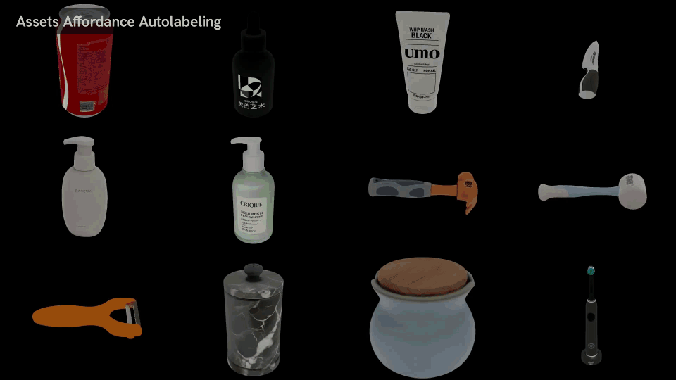

# 🕹️ Affordance — Semantic Parts & Grasps

Generate **part-level affordance annotations** for a simulator-ready URDF asset.

The pipeline labels three kinds of information: functional part segmentation, part-wise semantic affordances, and simulation-validated grasp poses. Starting from a URDF with visual and collision meshes, it assigns mesh faces to functional parts, annotates each part with interaction semantics, generates 6-DoF grasp candidates, and filters grasps with physics simulation.



---

## ⚡ Command-Line Usage

Install the optional affordance dependencies before running the pipeline:

```bash
bash install.sh affordance
```

The semantic annotation stage uses the project's GPT Agent. Configure `embodied_gen/utils/gpt_config.yaml` or export the corresponding environment variables described in the installation guide before running the full pipeline.

Run the demo asset:

```bash
affordance-cli \
  --urdf-paths apps/assets/example_affordance/ear_hear/sample.urdf \
  --output-dirs outputs/affordance_annotation/ear_hear
```

The input test case is:

```sh
apps/assets/example_affordance/ear_hear
├── mesh
│   ├── material.mtl
│   ├── material_0.png
│   ├── sample.obj
│   └── sample_collision.obj
└── sample.urdf
```

- `sample.urdf` provides the simulator-ready asset wrapper, object category, visual mesh, collision mesh, and physical parameters.
- `mesh/sample.obj` is used for visual rendering and part segmentation.
- `mesh/sample_collision.obj` is used for grasp generation and physical validation.

You can omit `--output-dirs`; by default, outputs are written to `affordance/` next to each input URDF.

---

## Pipeline Stages

The pipeline has three stages:

1. **Functional part segmentation**

    Segment the visual mesh into functional part regions.

2. **Part-wise semantic annotation**

    Annotate each part with semantic name, graspability, scenarios, functions, and appearance.

3. **Grasp generation and physical validation**

    Generate 6-DoF grasps and keep simulation-validated candidates.

Stages are dependent: semantics require segmentation, grasp generation requires semantics, and grasp evaluation requires generated grasps.

---

## Demo Output

Running the demo command above produced:

```sh
outputs/affordance_annotation/ear_hear
├── affordance_annot.json
└── mesh_part_seg.glb
```

The run also updates the input URDF in place with `custom_data` entries that point to the generated segmentation mesh and affordance JSON.

- `mesh_part_seg.glb` → colored part-segmentation mesh for visualization; it also stores per-face `face_ids` in metadata, readable via `embodied_gen.utils.io_utils.load_mesh`.
- `affordance_annot.json` → part-level affordance schema with semantic labels and simulation-filtered grasps.

An `affordance_annot.json` entry has this structure:

```json
{
  "part_name": "headband",
  "mask_color": "Red",
  "graspable": true,
  "grasp_scenarios": [
    {
      "scenario": "grasp the top of the headband to pick up the headphones",
      "confidence": 0.94
    }
  ],
  "functional_labels": [
    "bridge the two earcups",
    "rest on the top of the head",
    "support wearing",
    "provide a primary carrying point"
  ],
  "semantic_description": "Curved over-head band spanning the top of the headphones...",
  "id": 0,
  "grasp_group": {
    "grasp_0": {
      "confidence": 0.9834713339805603,
      "position": [0.09800969052594155, 0.0028345893369987607, 0.08563571982085705],
      "orientation": {
        "w": 0.6647695595179328,
        "xyz": [-0.08831381837710446, -0.7409686920659632, 0.035319960363011355]
      }
    }
  }
}
```

---

## Useful Options

- `--urdf-paths` → one or more input URDF files.
- `--output-dirs` → output directory for each URDF. The number of output directories must match the number of URDFs.
- `--no-run-part-seg` → skip functional part segmentation when `mesh_part_seg.glb` already exists and the URDF points to it.
- `--no-run-partsemantics-annot` → skip semantic annotation when `affordance_annot.json` already contains part records.
- `--no-run-grasp` → skip grasp generation when the JSON already contains `grasp_group` entries.
- `--no-run-grasp-eval` → skip SAPIEN grasp validation and keep generated grasp proposals unfiltered.

!!! tip "Getting Started"
    - Use `apps/assets/example_affordance/ear_hear/sample.urdf` as the first smoke test.
    - Use generated URDFs from [Image-to-3D](image_to_3d.md) or [Text-to-3D](text_to_3d.md) as inputs for new assets.
